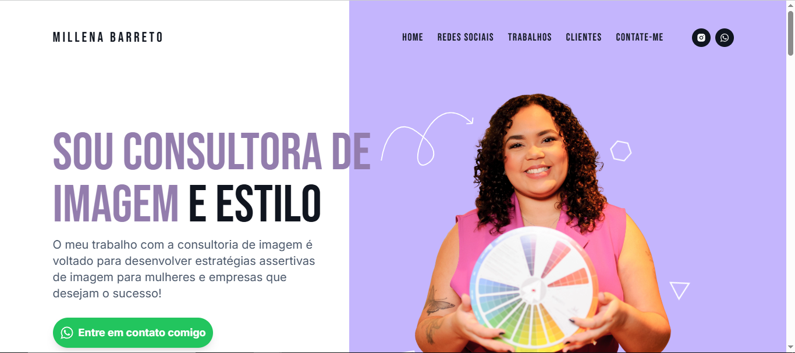
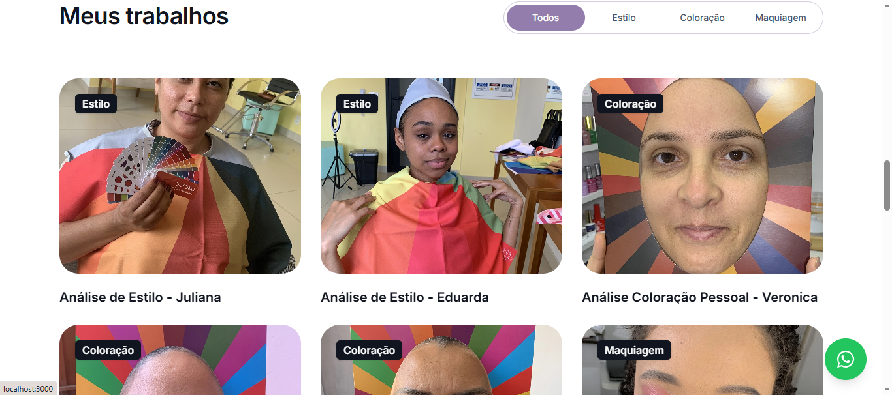

Millena Barreto Portfolio Website
This is a portfolio website developed by Jhon Everton for Millena Barreto, focusing on style consulting services.

Technologies Used:
Next.js: A React framework used for server-side rendering and static site generation.
Tailwind CSS: A utility-first CSS framework for rapid UI development.
Features:
Responsive Design: The website is fully responsive, ensuring a great user experience on all devices.
Interactive UI: Dynamic elements and smooth animations enhance user engagement.
View Website:
You can view the live website by visiting the link below: Website URL

Screenshots:
Here are some screenshots from the website:

Setup & Installation:
To run this project locally, follow the steps below:

Clone this repository:

bash
Copy
Edit
git clone https://github.com/your-username/portfolio-website.git
Install the required dependencies:

bash
Copy
Edit
cd portfolio-website
npm install
Run the development server:

bash
Copy
Edit
npm run dev
Open the website in your browser:

arduino
Copy
Edit
http://localhost:3000
License:
This project is licensed under the MIT License.